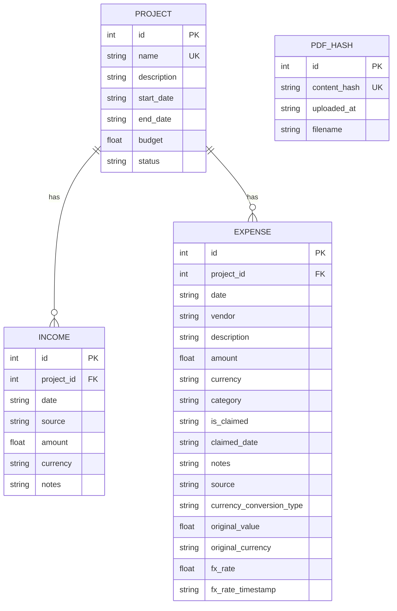

# Portman Project Expense & Claim Tracker

A project-based expense and income tracker with intelligent PDF bank statement ingestion, purpose-built for Malaysian financial workflows.

    

- Frontend URL: [http://35.239.249.236:8080](http://35.239.249.236:8080)
- FastAPI backend URL: [http://35.239.249.236:8000/docs](http://35.239.249.236:8000/docs)
- Github Repository URL: [https://github.com/advait404/Project-Expense-and-Claim-Tracker](https://github.com/advait404/Project-Expense-and-Claim-Tracker)

NOTE: The frontend currently does not support HTTPS. Web browsers may give a warning about insure HTTP connection.

WARNING: The Repository does not contain a valid OpenAI API key in the .env file. Please ask the developer for the keys or bring your own keys.


## Overview

The Expense & Claim Tracker is a full-stack financial companion designed to streamline project-based expense tracking and claim management. The core innovation is its **intelligent PDF ingestion engine**, which uses OpenAI's vision models to extract transactions directly from Malaysian bank statements and eliminates manual data entry while maintaining accuracy across multiple statement formats.

The app is built around three interconnected concepts:

- **Projects**: Organize expenses and income by project, with per-project dashboards and financial summaries.
- **Expenses & Income**: Track transactions with claim status, category, and multi-currency support for overseas transactions.
- **PDF Ingestion**: Two-step workflow (upload → review → confirm) that intelligently parses bank statements and stages transactions for validation before persisting to the database.

Designed for Malaysian users (MYR denomination), but can be extended to other currencies and banking systems.


## Features

✅ PDF bank statement parsing - Extract transactions automatically from Malaysian bank statements using OpenAI vision models; supports preview + manual confirmation before persisting.
✅ Two-step ingestion workflow - Upload PDF → automated extraction → preview and edit extracted transactions → confirm before saving to DB.
✅ Duplicate detection & warnings - PDF hash-based deduplication prevents re-imports and warns users about potential duplicates.
✅ Project-based organization - Group expenses and income by project, with cascading deletion
✅ Claim toggle - Mark expenses as claimed or unclaimed; bulk-toggle claim status in list view or individually in detail views.
✅ Currency conversion support - Stores original amounts, currency, and exchange rates for converted values.
✅ Expense categorization - Auto-suggest categories from parsed data with manual override available.
✅ Financial summaries & dashboards - Per-project dashboard (total income, total expenses, net, total claimed, total not claimed) and universal dashboard with totals and breakdowns by category and claim status.
✅ REST API - CRUD endpoints for Projects, Expenses, Income plus specialized PDF ingestion and aggregation routes for summaries and dashboards that reduce frontend data processing.
✅ Frontend UI - Responsive React 19 app styled with Tailwind CSS and shadcn/ui components; UI built with Lovable for consistent design system and UX patterns.
✅ Backend - Python FastAPI service with SQLite storage (modular design, consistent naming, proper status codes and error handling).
✅ Testing, docs & quality - Backend automated tests, detailed code comments, comprehensive documentation, and adherence to software engineering best practices.
✅ Privacy & security considerations - Design includes privacy and security measures (data handling and secure storage practices) and clear user warnings where appropriate.


## Tech Stack

### Frontend

- **React 19** - UI framework
- **TanStack Router** - Client-side routing
- **TanStack Query** - Data fetching and caching
- **Radix UI** - Headless component primitives
- **Tailwind CSS 4** - Utility-first styling
- **shadcn/ui** - Pre-built Radix + Tailwind components
- **React Hook Form + Zod** - Form management and validation

### Backend

- **FastAPI** - Modern async Python web framework
- **SQLAlchemy** - SQL toolkit and ORM
- **SQLite** - Embedded relational database (with Postgres migration path available)
- **pdfminer.six** - PDF text extraction
- **pdf2image** - PDF to PNG rasterization
- **Poppler** - PDF rendering engine
- **OpenAI API** - Vision model for transaction extraction
- **Pydantic** - Data validation and serialization
- **Loguru** - Structured logging with context tracking


## Frontend Overview

### Pages

1. `/` Dashboard - totals + per-project cards (income, expenses, net, claimed, unclaimed)
2. `/projects` - table with create/edit dialog and delete
3. `/expenses` - full filter row (project, category, date range, claim status), inline claimed Switch with optimistic update, source badge (manual/pdf), edit/add modal
4. `/income` - manual-only entries, project filter, CRUD modal
5. `/pdf-import` - two-step flow: upload → editable review table (date, description, amount, currency, category) → confirm or cancel

### Structure

- `src/api/` - `client.ts` (single `apiRequest` wrapper, change `BASE_URL` to point at FastAPI), plus `projects.ts`, `expenses.ts`, `income.ts`, `pdf.ts`
- `src/types/` - shared types (Project, Expense, Income, ParsedTransaction, etc.)
- `src/hooks/useProjects.ts` - reusable project loader
- `src/components/` - `AppSidebar`, `PageHeader`, `States` (Loading/Error/Empty)
- `src/lib/format.ts` - `formatMYR` (RM prefix, negatives styled distinctly)

### UX

- Collapsible sidebar with active highlighting
- All forms in modal dialogs
- Loading / error / empty states everywhere
- Sonner toasts for save/delete feedback
- Claimed = green badge, Unclaimed = warning outline, negatives in destructive color
- Clean blue/neutral OKLCH design tokens, no heavy gradients

Backend is auto-adaptive: `BASE_URL` in `src/api/client.ts` auto-detects the backend URL for FastAPI connection. It can also be set manually.

## Backend Architecture Overview

The application follows a three-layer architecture:

**API Layer** (`main.py`,`projects.py`,`income_expenses.py` as routers) - FastAPI application serving REST endpoints. Handles request validation via Pydantic, dependency injection, and HTTP response codes.

**Database Layer** (`models.py`, `database.py`) - SQLAlchemy ORM models with thread-safe SQLite connection pooling. Auto-initializes schema on startup with cascading foreign key constraints.

**Business Logic Layer** - PDF ingestion pipeline, CRUD operations, and financial aggregations. The PDF pipeline is the most distinctive component (see section below).

### Data Model

(If the below diagram is not rendered, please view the [docs/ERD_diagram.png](docs/ERD_diagram.png))



- **Project → Income** (1:N): One project has many income records
- **Project → Expense** (1:N): One project has many expense records
- **PdfHash** (Independent): Standalone tracking of PDF uploads, no foreign key relationships

### Field Descriptions

- TODO

#### Project

- **Purpose**: Top-level container for expenses and income
- **Key Fields**:
  - `name`: Unique project identifier
  - `status`: One of 'active', 'on_hold', 'closed', 'archived'
  - `budget`: Optional budget amount in MYR
  - `start_date`, `end_date`: ISO 8601 date strings

#### Income

- **Purpose**: Manually entered income records (never from PDF)
- **Relationships**: Many-to-One with Project
- **Key Fields**:
  - `source`: Description of income source (e.g., 'Client Payment')
  - `amount`: Positive floating-point value
  - `currency`: Currency code (e.g., 'MYR', 'USD')

#### Expense

- **Purpose**: Transaction records from manual entry or PDF import
- **Relationships**: Many-to-One with Project
- **Key Fields**:
  - `source`: Either 'manual' or 'pdf'
  - `is_claimed`: Boolean stored as String ('true'/'false') for SQLite compatibility
  - `category`: Expense category (e.g., 'Travel', 'Meals', 'Equipment')
  - **Currency Conversion Fields**:
    - `currency_conversion_type`: 'native', 'converted_by_bank', or 'converted_by_system'
    - `original_value`: Amount before conversion
    - `original_currency`: Original currency code
    - `fx_rate`: Exchange rate used
    - `fx_rate_timestamp`: ISO 8601 date when rate was obtained

#### PdfHash

- **Purpose**: Track uploaded PDFs for duplicate detection
- **Key Fields**:
  - `content_hash`: SHA256 hash of normalized PDF text (unique)
  - `uploaded_at`: ISO 8601 timestamp of upload
  - `filename`: Original filename


## PDF Ingestion Pipeline

The Tracker's signature feature is its PDF bank statement ingestion workflow. Instead of parsing directly to the database, the pipeline extracts and validates transactions in memory, allowing users to review and correct them before committing.

### Workflow Overview

The PDF upload is **asynchronous** to prevent blocking on large files or slow API calls:

1. **Upload** - User selects a PDF file (max 50MB); immediately returns `upload_id` with status "processing"
2. **Background Processing** (runs asynchronously):
   - **Hash Check** - Compute SHA256 hash of PDF text; inform user of duplicate upload
   - **Image Conversion** - Render PDF pages as PNG images via pdf2image + Poppler (runs in ThreadPoolExecutor)
   - **Vision Extraction** - Send all images to OpenAI vision model; extract raw transaction data
   - **Text Normalization and JSON Parsing** - A second OpenAI call to clean and normalize dates, amounts, names, etc. and converting raw text into structured JSON
   - **Job Status Update** - Record final result (success/error) in job tracker
3. **Status Polling** - Frontend polls `/api/pdf/status/{upload_id}` to check processing progress
4. **Preview Stage** - When status is "done", return extracted transactions to frontend for user review
5. **Confirmation** - User reviews, corrects, and submits for persistence
6. **Database Write** - Persist validated transactions; record PDF hash to prevent re-import

### Ingestion Rules

The pipeline applies these critical rules when parsing Malaysian bank statements:

- **Removal of Non-Transactional sections**: All information that is not relevant to the transaction details are removed.
- **CR Suffix Exclusion**: Transactions with a "CR" suffix are credits (payments/refunds), not expenses. These are excluded automatically.
- **Overseas Transaction Handling**: When a transaction is in a foreign currency (e.g., USD), the pipeline stores: the original amount, original currency code, exchange rate applied, and conversion type (bank-handled vs. system-calculated).
- **Date Field Priority**: The transaction date is the primary date value; post date is stored only if it is found in the statement.
- **0 MYR Transaction Excluded**: Transaction where there is no money transfer is excluded.


## Design Decisions

### Why OpenAI Vision Models Over Traditional OCR?

Traditional OCR and text extraction (e.g., pdfminer) struggle with the layout complexity of bank statements. Different banks format statements differently. For example, transaction rows may be multiline, amounts might use different separators, and headers/footers vary. OpenAI's vision models (GPT-5.4 mini used here) understand visual layout and context, making them far robuster across multiple statement formats. The trade-off is cost (~$0.01 USD per statement) and latency (~3-5 seconds), but this is negligible for a deliverable app handling large batch imports or occasional manual entry.

Several GenAI model providers also allow batch processing, which can be used to convert each PDF page into images so pages can be processed in parallel for much faster throughput, reduces per-document costs through bulk discounts, and produces clean, post-processed structured outputs (CSV, JSON, etc.) ready for direct database ingestion.

Additionally, local VLM models also work very well for this use case.For example, QWEN3.5 9B model (6.1GB size) was tested with the sample PDF and was able to provide the transaction records with very high accuracy. This gives us a large amount of flexibility on selecting the most suitable model and approach, along with being more privacy friendly if it is self hosted.

### Why SQLite Over PostgreSQL?

For the scope of this project—a deliverable with a known feature set and no production scaling requirements—SQLite is ideal. It requires zero infrastructure, is trivially easy to bundle with the app, and allows developers to start immediately without database setup. The data model includes no complex relationships that would demand PostGIS or advanced indexing, and transaction volume will never push SQLite's limits. When this project scales to multi-tenant cloud deployment, migrating to PostgreSQL or any other cloud-hosted database service is straightforward (SQLAlchemy abstracts the dialect layer).

### Two-Step Confirmation Workflow

Staging extracted transactions in memory before persisting protects against partial writes and allows users to validate the AI's extraction before committing. This is especially critical for financial data—users expect to review transactions before they're recorded. The in-memory staging also makes it trivial to add future features (manual edits in the preview UI, bulk categorization, etc.) without touching the database layer.

## File storage and deletion

All uploaded and generated files are removed promptly for privacy and best practices: PNGs are cleaned up immediately using a context manager with delete=True, and PDFs are stored in the system temporary directly and deleted upon use.


## API Reference

### Projects

| Method | Endpoint                               | Description               | Response       |
|  | -- | - | -- |
| POST   | `/api/projects`                      | Create a new project      | 201 Created    |
| GET    | `/api/projects`                      | List all projects         | 200 OK (array) |
| GET    | `/api/projects/{project_id}`         | Get project details       | 200 OK         |
| PUT    | `/api/projects/{project_id}`         | Update project            | 200 OK         |
| DELETE | `/api/projects/{project_id}`         | Delete project (cascades) | 200 OK         |
| GET    | `/api/projects/summary`              | Get financial summary     | 200 OK         |

### Expenses

| Method | Endpoint                             | Description                           | Response       |
|  |  | - | -- |
| POST   | `/api/expenses`                    | Create expense                        | 201 Created    |
| GET    | `/api/expenses`                    | List expenses                         | 200 OK (array) |
| PUT    | `/api/expenses/{expense_id}`       | Update expense                        | 200 OK         |
| DELETE | `/api/expenses/{expense_id}`       | Delete expense                        | 200 OK         |
| POST   | `/api/expenses/bulk-claim`         | Bulk claim toggle                     | 200 OK         |

### Income

| Method | Endpoint                    | Description                         | Response       |
|  |  | -- | -- |
| POST   | `/api/income`             | Create income                       | 201 Created    |
| GET    | `/api/income`             | List income (filterable by project) | 200 OK (array) |
| PUT    | `/api/income/{income_id}` | Update income                       | 200 OK         |
| DELETE | `/api/income/{income_id}` | Delete income                       | 200 OK         |

### PDF Import

| Method | Endpoint                        | Description                         | Response    |
|  | - | -- | -- |
| POST   | `/api/pdf/upload`             | Upload PDF for async processing     | 200 OK      |
| GET    | `/api/pdf/status/{upload_id}` | Check job status & retrieve results | 200 OK      |
| POST   | `/api/pdf/confirm`            | Persist extracted transactions      | 201 Created |

### Error Codes

| Code          | Meaning              | Common Causes                                   |
| - | -- | -- |
| **400** | Bad Request          | Malformed JSON, missing required fields         |
| **404** | Not Found            | Resource does not exist                         |
| **413** | Payload Too Large    | PDF exceeds 50MB limit                          |
| **422** | Unprocessable Entity | Validation failure (Pydantic schema mismatch)   |
| **500** | Server Error         | Unexpected exception (e.g., OpenAI API timeout) |

All validation errors include a `detail` field with field-level error messages.


## Setup & Installation

### Local Deployment

**Prerequisites:**

- Python 3.11+
- Node.js 22+
- OpenAI API key (set as `OPENAI_API_KEY` environment variable)
- Poppler (for PDF rendering): Install via `brew install poppler` (macOS) or `apt-get install poppler-utils` (Linux)
- UV python package manager <https://docs.astral.sh/uv/getting-started/installation>

**Backend Setup:**

```bash
git clone https://github.com/advait404/Project-Expense-and-Claim-Tracker
cd
uv sync

# Create a .env file with your OpenAI key
echo "OPENAI_API_KEY=sk-..." > backend/.env

# Start the server
uv run uvicorn backend.main:app --host 0.0.0.0 --port 8000
# Server runs on http://localhost:8000 and on public IP
```

**Frontend Setup:**

```bash
cd frontend
npm install
npm run dev
# Dev server runs on http://localhost:8080 and on public IP
```

The SQLite database (`projects.db`) is created automatically on first startup. No manual migrations needed.

### Cloud Deployment

The application is deployed on Google Compute Engine as a single VM instance.

**Cloud Infrastructure Setup:**

- Launch a VM instance on GCP Compute Engine. Recommended size is e2-medium (2 vCPUs, 4 GB Memory). Smaller instances may take much more time installing dependencies
- Edit the Firewall Policies of the network to allow incoming and outgoing traffic from the public. Recommended to open ports 22,80,443,8000.8080. For testing purposes, all ports can be opened temporarily
- SSH into the server. The GCP console provides an option to open a ssh terminal in the browser
- Follow the local deployment process.
- Test the app on the Public IP of the instance

## Configuration

All configuration constants are centralized in `backend/common_constants.py`. Some of the important ones are mentioned below:

| Constant                           | Default Value               | Purpose                                 |
| - |  |  |
| `OPENAI_MODEL`                   | `gpt-5.4-mini`              | Vision model for transaction extraction |
| `OPENAI_MAX_OUTPUT_TOKENS`       | 6000                        | Max tokens per OpenAI response          |
| `DATABASE_URL`                   | `sqlite:///./projects.db`   | SQLite database file path               |
| `THREAD_POOL_MAX_WORKERS`        | 4                           | Async executor thread count             |
| `CORS_ALLOW_ORIGINS`             | `["*"]`                     | CORS allowed origins                    |
| `MAX_PDF_FILE_SIZE`              | 50MB                        | Maximum PDF upload size                 |
| `DEFAULT_CURRENCY`               | MYR                         | Default currency for transactions       |
| `PDF_UNICODE_NORMALIZATION_FORM` | NFKC                        | Unicode normalization for PDF hashing   |

Override any constant by setting a corresponding environment variable (e.g., `OPENAI_MODEL=gpt-4-turbo`).


## Error Handling

The Tracker uses a two-layer error handling approach:

**Schema Validation (FastAPI + Pydantic)** - Request payloads are validated automatically against Pydantic models. Validation failures return HTTP 422 with field-level error details:

```json
{
  "detail": [
    {
      "loc": ["body", "amount_myr"],
      "msg": "ensure this value is greater than 0",
      "type": "value_error.number.not_gt"
    }
  ]
}
```

**Domain Errors (Custom Handlers)** - Business logic errors (e.g., project not found, PDF already uploaded) are handled by custom exception handlers, returning user-friendly 4xx responses:

```json
{
  "detail": "Project with ID 42 not found"
}
```

All error responses include an HTTP status code and a human-readable `detail` message. See [docs/ARCHITECTURE.md](docs/ARCHITECTURE.md) for the full error handling architecture and implementation details.


## Future Improvements

### Core Banking Features

- **Multi-bank statement support** - Extend and Test PDF parsing to handle Maybank, CIMB, Public Bank, and other Malaysian and Foreign institution formats
- **Multi-currency support** - Add comprehensive support for SGD, USD, and other currencies beyond MYR, including UI currency selection and processing of non-converted bank transactions
- **Enhanced duplicate detection** - Implement advanced deduplication using date, amount, and semantic search on transaction descriptions
- **System-calculated conversion types** - Automatic currency conversion with real-time exchange rates

### Data Processing & Extraction

- **Automated transaction categorization** - Machine learning models to auto-categorize transactions based on merchant patterns and amounts
- **Complex PDF workflow** - Advanced table extraction using AWS Textract or similar services along with user-guided selection of relevant data components

### User Experience & Interface

- **Human-in-the-loop verification** - Admin interface for flagging and manually reviewing low-confidence extractions
- **CSV/Excel export functionality** - Download project summaries and transaction lists in standard formats
- **Improved UI theming** - Add favicon, images, and consistent color theming
- **User authentication system** - Multi-user support with role-based access control

### Infrastructure & DevOps

- **PostgreSQL migration** - Production-ready database backend for scalable multi-instance cloud deployment
- **GCP Secret Manager integration** - Secure credential storage for deployed instances
- **Comprehensive testing suite** - Full coverage for PDF pipeline edge cases and error handling
- **Automated documentation generation** - Implement PyDoc-based documentation system
- **Advanced resource profiling** - Implement resource tracking and profiling tools to monitor API usage costs, PDF processing performance metrics, database query optimization, and system bottlenecks for improved scalability and cost management

### Quality Assurance & Monitoring

- **Cost tracking and resource monitoring** - Detailed breakdown of API usage and system resource consumption
- **Enhanced logging system** - Comprehensive logs for GenAI API calls and processing metrics

This architecture ensures scalability and flexibility while maintaining accuracy through human oversight—particularly crucial for financial applications where precision is paramount.

*With one additional week of development time, priority would focus on multi-bank PDF support and the Cloud Infrastructure setup, as these provide the highest user value and system reliability improvements.*

## Development Notes

### Cost & Resource Usage

- **OpenAI API Costs**: Processing a typical 2-page Malaysian bank statement costs approximately **$0.01 USD** per document. This includes both the initial vision extraction and the follow-up normalization call. Cost scales linearly with PDF page count, but can be reduced with batch processing in the future.
- **Development Environment**: Tested on AMD Ryzen 5 7535HS (12 cores), 24GB RAM, running Fedora Linux 43 with KDE Plasma on Wayland. PDF processing and OpenAI API calls perform consistently across different hardware configurations.
- **Production Hosting**: Deployed on GCP e2-medium instance (2 vCPUs, 4GB RAM) with sufficient resources for concurrent PDF processing and API operations. No resource profiling implemented in current version. Instance can probably be downsized in the future since resource usage is low.

### AI Development Assistance

Claude Code with Haiku 4.5 model was extensively used as a coding assistant throughout this project and greatly assisted in generating new functionality and implementation patterns. However, it also required providing detailed, granular instructions and breaking down complex tasks into smaller, manageable segments. Attempting large-scale code generation, especially those that change both backend and frontend, often introduced errors. Manual oversight was critical, as the AI-generated code sometimes required debugging and refinement, especially for edge cases and integration points. Purely relying on the agent without understanding the generated code can create dangerous technical debt that made debugging extremely complex. Additionally, architectural decisions and code organization required human guidance, as the AI defaulted to simpler, less scalable structures that didn't align with production-quality requirements. The most successful approach involved using AI as an accelerated development tool while maintaining human control over system design, code review, and quality assurance processes.
